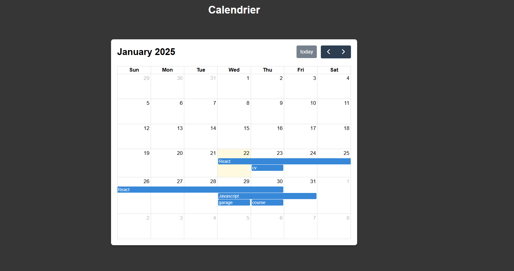

# Dynamic Calendar with Event Popup

This project is a dynamic and interactive calendar application built using FullCalendar.js and Node.js. The main feature of this calendar is the ability to add events via a popup form. All events are saved on the server and persist even after refreshing the page. 💪

Through this project, I enhanced my skills in backend communication, event handling, and responsive user interface design while ensuring seamless integration between the client and server.


## Screenshots




## Code Exemple

### JavaScript (Client Side)
```javascript
document.addEventListener('DOMContentLoaded', function () {
  const calendarEl = document.getElementById('calendar');
  const modal = document.getElementById('eventModal');
  const eventNameInput = document.getElementById('eventName');
  const startDateInput = document.getElementById('startDate');
  const endDateInput = document.getElementById('endDate');
  const saveEventBtn = document.getElementById('saveEventBtn');

  const calendar = new FullCalendar.Calendar(calendarEl, {
    initialView: 'dayGridMonth',
    selectable: true,
    events: '/events', // Load events from server
    select: function (info) {
      modal.style.display = 'block';
      startDateInput.value = info.startStr;
      endDateInput.value = info.endStr;
      eventNameInput.value = '';
    },
  });

  saveEventBtn.onclick = function () {
    const eventName = eventNameInput.value;
    if (eventName) {
      calendar.addEvent({
        title: eventName,
        start: startDateInput.value,
        end: endDateInput.value,
      });

      fetch('/addEvent', {
        method: 'POST',
        headers: { 'Content-Type': 'application/json' },
        body: JSON.stringify({
          title: eventName,
          start: startDateInput.value,
          end: endDateInput.value,
        }),
      }).catch(error => console.error('Error saving event:', error));

      modal.style.display = 'none';
    }
  };

  calendar.render();
});
```
## Technologies Used

- **HTML**: For structure and content.
- **CSS**: For styling the application.
- **JavaScript**: For interactivity and client-server communication.
- **Node.js**: Backend server to handle event storage.
- **FullCalendar.js**: Interactive and feature-rich calendar library.

## License

[MIT](https://choosealicense.com/licenses/mit/)

